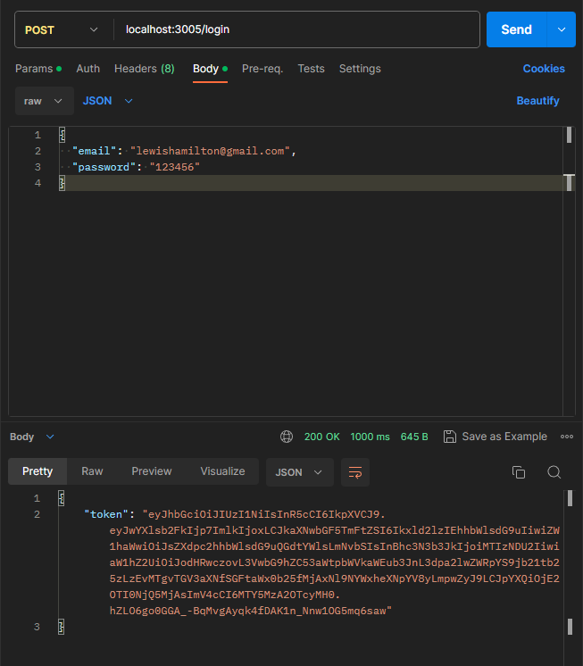

# Blogs-api
TypeScript

## Dependencies
```bash
    "change-case": "4.1.2",
    "eslint-config-trybe-backend": "2.1.0",
    "frisby": "2.1.2",
    "jest": "26.0.1",
    "jest-each": "28.0.1",
    "nodemon": "2.0.22",
    "sequelize-cli": "6.2.0",
    "sequelize-jest-helpers-trybe": "1.0.0",
    "supertest": "4.0.2",
    "wait-on": "6.0.1"
```

## Project Description

In this project, you will develop an API and a database for generating content for a blog!

You are required to create a Node.js application using the Sequelize package to perform CRUD operations on posts.

You should develop endpoints that are connected to your database, following the principles of REST.

To create a post, both a user and login are necessary, which means you will work on establishing the relationship between users and posts.

The utilization of categories for posts will also be necessary. This involves working on the relationship between posts and categories, as well as between categories and posts.

## Use Project

- Start Docker
```bash
docker-compose up -d --build
```

- Access container Docker
```bash
docker exec -it blogs_api bash
```
- Install dependencies in container
```bash
npm install
```

- Create DB and Tables
```bash
npm run prestart
```
-Insert Seeds
```bash
npm run seed
```
